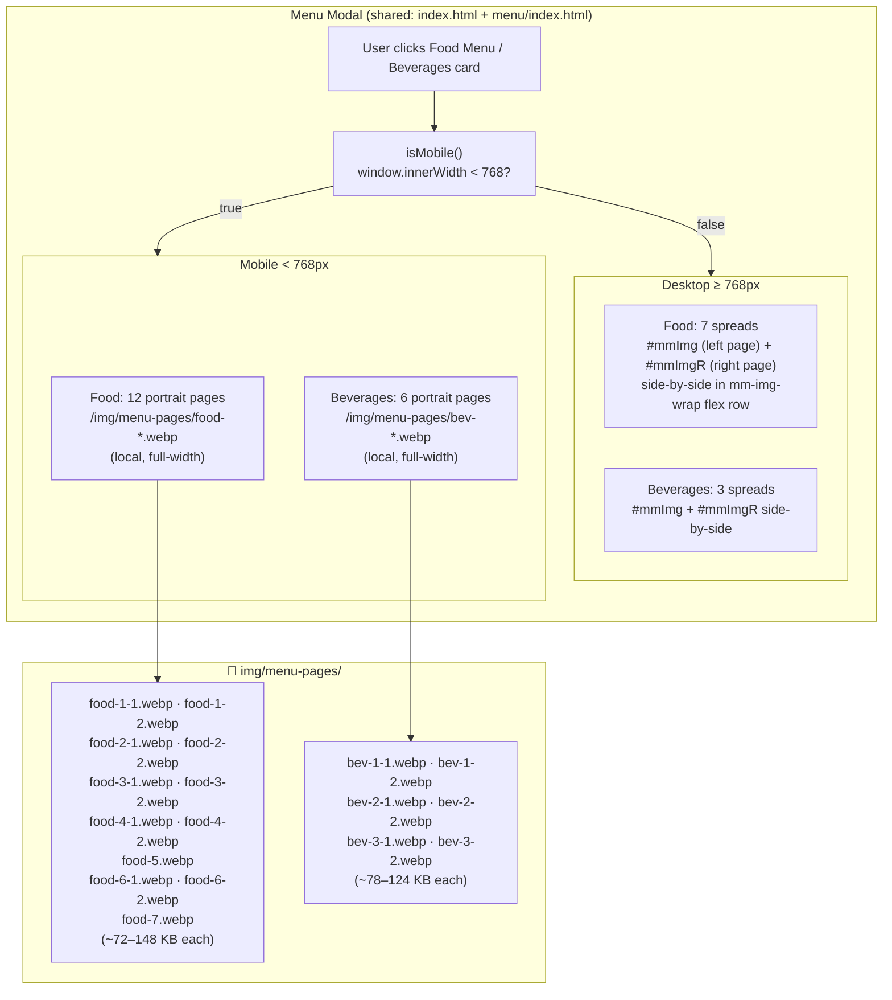
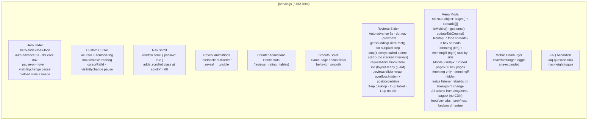
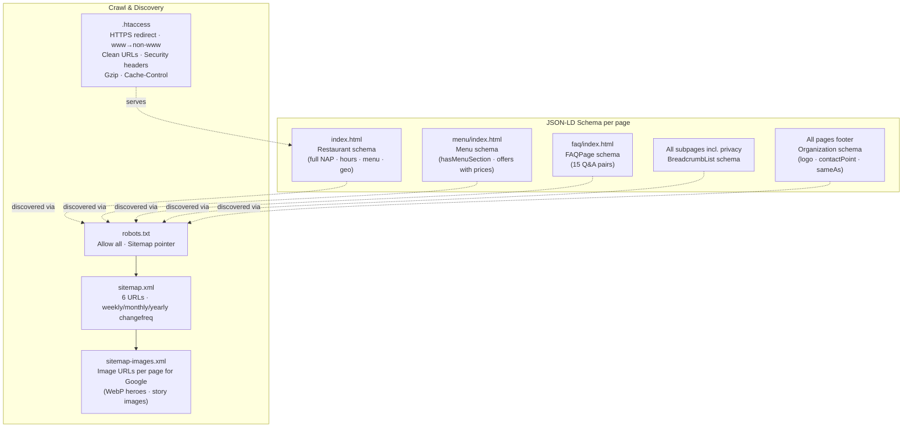
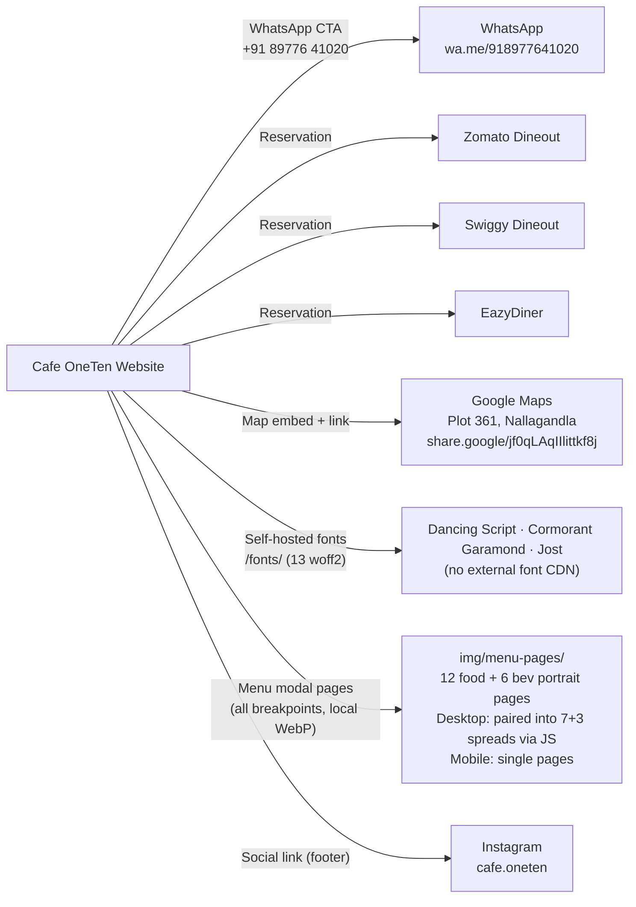

# Cafe OneTen — Codebase Sitemap & Architecture

## Site URL Structure

| Route | File | Description |
|-------|------|-------------|
| `/` | `index.html` | Home — hero slider (day/night cross-fade, dot nav, Reserve a Table + Explore Menu CTAs), marquee, story, quick facts, food, menu gallery, experience, menu preview, reviews, visit. Hero images served as WebP with srcset from `img/heroes/`; preload hint in `<head>`. `<title>` is just "Cafe OneTen". |
| `/menu` | `menu/index.html` | Full menu with prices, categories, menu modal |
| `/visit` | `visit/index.html` | Hours, map, reservation buttons |
| `/story` | `story/index.html` | Brand story, editorial narrative, The Space dark panel |
| `/faq` | `faq/index.html` | 15 FAQ accordions, FAQPage schema |
| `/privacy` | `privacy/index.html` | Privacy policy — no cookies, no user data, third-party services listed |
| `/404` | `404.html` | Branded error page |

---

## Codebase Architecture (Mermaid)

```mermaid
graph TD
    subgraph ROOT["📁 Cafe110 (root)"]
        HOME["index.html\n(Home)"]
        F404["404.html"]
        ROBOTS["robots.txt"]
        MANIFEST["manifest.json"]
        SITEMAP_XML["sitemap.xml"]
        SITEMAP_IMG["sitemap-images.xml"]
        HTACCESS[".htaccess"]
    end

    subgraph PAGES["📁 Pages"]
        MENU["menu/index.html"]
        VISIT["visit/index.html"]
        STORY["story/index.html"]
        FAQ["faq/index.html"]
        PRIVACY["privacy/index.html"]
    end

    subgraph ASSETS["📁 Static Assets"]
        CSS["css/style.css\n(~1794 lines — @font-face rules merged at top,\nthen reset, tokens, all page styles)\nfonts/fonts.css — legacy stub, no longer linked"]
        JS["js/main.js\n(~460 lines — cursor, nav scroll, reveal,\nsmooth scroll, reviews slider, menu modal)"]
    end

    subgraph IMAGES["📁 img/"]
        HEROES["heroes/\n— Subpage heroes (WebP + PNG) —\nfaq-hero-desktop.webp/.png · faq-hero-mobile.webp/.png\nmenu-hero-desktop.webp/.png · menu-hero-mobile.webp/.png\nstory-hero-desktop.webp/.png · story-hero-mobile.webp/.png\nvisit-hero-desktop.webp/.png · visit-hero-mobile.webp/.png\n— Home hero WebP variants —\nhero-day-480w.webp · -800w · -1200w · -1619w\nhero-night-480w.webp · -800w · -1200w · -1619w\nhero-day-mobile-480w.webp · -852w\nhero-night-mobile-480w.webp · -852w"]
        STORY_IMG["story/\nstory-letter-card-cafe-oneten.jpg ← active letter card\nOurstory.avif (source, kept for reference)\ncafeoneten-exterior-1.png\ncafeoneten-exterior-2.png\nillustrated-logo-cafe-oneten.webp"]
        DISHES["dishes/\n5 local WebP signature dish images\ndeconstructed-tiramisu-cafe-oneten.webp\npaneer-spinach-pizza-cafe-oneten.webp\npavlova-cafe-oneten.webp\nfrench-toast-cafe-oneten.webp\nchocolate-strawberries-cafe-oneten.webp"]
        MENU_PAGES["menu-pages/ ← portrait pages (mobile + desktop spread source)\nfood-1-1.webp … food-7.webp (12 pages)\nbev-1-1.webp … bev-3-2.webp (6 pages)"]
        OG["og/\nog-cafe-oneten-1200x630.jpg\n(1200×630 — OG/Twitter Card image)"]
        FAV["favicon/\nfavicon.svg (embedded PNG, ~5.7KB)\nfavicon-32.png · favicon-192.png\nfavicon-512.png · apple-touch-icon.png\nAll: gold 'OneTen' wordmark on WHITE bg, rounded corners (~22% radius)\nSource: OneTen Gold Logo.webp (tight-cropped, square-padded via Python/PIL)"]
    end

    subgraph HERO_SLIDER["📁 Hero Slider — source PNGs (root, used as fallback)"]
        HS1["Home-hero-1-Final.png\n(Slide 1 — daytime exterior\n↳ WebP: img/heroes/hero-day-{480,800,1200,1619}w.webp)"]
        HS1M["Home-hero-1-Final-Mobile.png\n(Slide 1 — mobile portrait\n↳ WebP: img/heroes/hero-day-mobile-{480,852}w.webp)"]
        HS2["Home-hero-1-Final-n.png\n(Slide 2 — evening string lights\n↳ WebP: img/heroes/hero-night-{480,800,1200,1619}w.webp)"]
        HS2M["Home-hero-1-Final-n-Mobile.png\n(Slide 2 — mobile portrait\n↳ WebP: img/heroes/hero-night-mobile-{480,852}w.webp)"]
    end

    subgraph EXP_IMGS["📁 img/interior/ — Experience Section Images"]
        EI1["morning-exterior-cafe-oneten.webp ← served via picture\nmorning-exterior-cafe-oneten.png  ← PNG fallback\n(003 / The Space — exterior, large top slot)\n3.2 MB PNG → 439 KB WebP (86% reduction)"]
        EI2["interior-warm-ambient-cafe-oneten.webp\n(003 / The Space — warm indoor with pendant lamps)"]
        EI3["rooftop-glass-terrace-cafe-oneten.webp\n(003 / The Space — glass-roofed Gazebo)"]
        EI4["interior-spacious-dining-cafe-oneten.webp\n(003 / The Space — spacious interior, full-width slot)"]
    end

    subgraph SEO["📄 SEO & PWA"]
        ROBOTS
        MANIFEST
        SITEMAP_XML
        SITEMAP_IMG
        HTACCESS
    end

    HOME -->|"link rel=stylesheet"| CSS
    HOME -->|"script src"| JS
    MENU -->|"link rel=stylesheet"| CSS
    MENU -->|"script src"| JS
    VISIT -->|"link rel=stylesheet"| CSS
    VISIT -->|"script src"| JS
    STORY -->|"link rel=stylesheet"| CSS
    STORY -->|"script src"| JS
    FAQ -->|"link rel=stylesheet"| CSS
    FAQ -->|"script src"| JS
    PRIVACY -->|"link rel=stylesheet"| CSS
    PRIVACY -->|"script src"| JS

    HOME -->|"nav links"| MENU
    HOME -->|"nav links"| VISIT
    HOME -->|"nav links"| STORY
    HOME -->|"nav links"| FAQ

    HOME -->|"hero-slide 1 desktop"| HS1
    HOME -->|"hero-slide 1 mobile"| HS1M
    HOME -->|"hero-slide 2 desktop"| HS2
    HOME -->|"hero-slide 2 mobile"| HS2M

    MENU -->|"hero <picture> WebP+PNG"| HEROES
    VISIT -->|"hero <picture> WebP+PNG"| HEROES
    STORY -->|"hero <picture> WebP+PNG"| HEROES
    STORY -->|"letter card img"| STORY_IMG
    FAQ -->|"hero <picture> WebP+PNG"| HEROES

    HOME -->|"food cards (5)"| DISHES
    HOME -->|"experience img (slot 1)"| EI1
    HOME -->|"experience img (slot 2)"| EI2
    HOME -->|"experience img (slot 3)"| EI3
    HOME -->|"experience img (slot 4)"| EI4

    JS -->|"modal pages (all breakpoints)"| MENU_PAGES
    HOME -->|"favicon"| FAV
    MENU -->|"favicon"| FAV
    HOME -->|"og:image"| OG
```

---

## Page-by-Page Section Map

```mermaid
graph LR
    subgraph HOME_MAP["index.html — Home"]
        direction TB
        H1["🎬 Hero Slider\n(2 slides: day + night cross-fade 1.4s\nauto-advance 6s · dot nav · pause-on-hover\n<picture> + srcset WebP (img/heroes/) · PNG fallback\nDual preload in head: mobile media=(max-width:767px) → hero-day-mobile-{480,852}w.webp\n                     desktop media=(min-width:768px) → hero-day-{480,800,1200,1619}w.webp\nSlide 1 img: fetchpriority=high · decoding=sync\nSlide 2 img: loading=lazy · decoding=async\nReserve a Table + Explore Menu CTAs\nbottom-right desktop · bottom-left mobile\nMobile: .hero-dots bottom:20vh (above) · .hero-cta-group bottom:10vh (below dots)\nNav: gold 'Reserve on WhatsApp' .nav-cta (desktop) · nmm-cta (mobile drawer)\nNo scroll indicator — removed)"]
        H2["📢 Marquee\n(aria-hidden scrolling text)"]
        H3["📖 Story Section\n(001 / Our Story\nHeading: 'From the very beginning.'\nLetter-style narrative — no images\nSign-off: 'With love, OneTen')"]
        H5["🍽️ Food Section\n(002 / Signature Dishes — 5 local WebP cards from img/dishes/)"]
        H6["🖼️ Menu Gallery\n(2 image cards: Food + Bev, opens modal)"]
        H7["✨ Experience Section\n(003 / The Space\nHeading: 'Built from the ground up. Intentional corners all around.'\n4 images from img/interior/:\nmorning-exterior-cafe-oneten.png\ninterior-warm-ambient-cafe-oneten.webp\nrooftop-glass-terrace-cafe-oneten.webp\ninterior-spacious-dining-cafe-oneten.webp\n5 features with SVG icons in gold circles:\nLeaf · Lightbulb · Umbrella · Candle · Music note)"]
        H9["📋 Menu Preview\n(004 / Menu\nHeading: 'What we serve: Mindfully Sourced'\nSmall Plates · Mains · Desserts · Beverages\n4 items each — no badges)"]
        H10["⭐ Reviews Slider\n(8 Google reviews · 4.6★ · 220+ reviews\nauto-advance 5s · prev/next · dot nav\npause-on-hover/touch · loops back to start)"]
        H12["🦶 Footer\n(4 columns: Brand · Pages · Contact · Hours & Find Us\nPages: Home · Menu · Visit · Story · FAQ · Privacy\nBrand: logo · tagline · SVG amenity icons (paw/P/wifi) · Instagram link\nContact: phone · WhatsApp · Zomato · Swiggy Dineout · EazyDiner · Google Maps\nHours & Find Us: Mon–Thu 10:30PM · Fri–Sun 11PM · address\nBottom bar: copyright · 'Developed with ♥ by Shiva & Rohan' → WhatsApp)"]
        H1-->H2-->H3-->H5-->H6-->H7-->H9-->H10-->H12
    end

    subgraph MENU_MAP["menu/index.html"]
        direction TB
        M1["🎬 Full-screen Hero\n(<picture> menu-hero-desktop.webp/.png)"]
        M2["🖼️ Menu Gallery Cards\n(Food Menu · Beverages — opens modal)"]
        M3["📋 Full Menu Items\n(Small Plates · Mains · Brunch\nDesserts · Coffee · Teas & Others)"]
        M4["📞 CTA Strip"]
        M5["🦶 Footer\n(shared — see Home footer)"]
        M1-->M2-->M3-->M4-->M5
    end

    subgraph VISIT_MAP["visit/index.html"]
        direction TB
        V1["🎬 Full-screen Hero\n(<picture> visit-hero-desktop.webp/.png)"]
        V2["⏰ Hours Table\n(Mon–Thu 10:30 PM\nFri–Sun 11 PM)"]
        V2B["📋 Contact Info Block\n(SVG icons: phone · pin · car · leaf · arrow\n+91 89776 41020 · address · parking · amenities · directions)"]
        V3["🗺️ Reserve Buttons\n(WhatsApp · Zomato · Swiggy · EazyDiner\nWhatsApp = gold bg · espresso text (primary)\nZomato/Swiggy/EazyDiner = espresso bg · cream text · gold arrow\nNo platform brand colors — all on-brand palette)"]
        V4["📍 Google Maps Embed\n(share.google/jf0qLAqIIlittkf8j)\nGetting Here card with SVG pin label"]
        V5["🦶 Footer\n(shared — see Home footer)"]
        V1-->V2-->V2B-->V3-->V4-->V5
    end

    subgraph STORY_MAP["story/index.html"]
        direction TB
        S1["🎬 Full-screen Hero\n(<picture> story-hero-desktop.webp/.png)"]
        S2["📜 Letter Card\n('From the very beginning.'\nbody text · closing · sign-off\nimg: story-letter-card-cafe-oneten.jpg)"]
        S3["📞 CTA Strip"]
        S4["🦶 Footer\n(shared — see Home footer)"]
        S1-->S2-->S3-->S4
    end

    subgraph FAQ_MAP["faq/index.html"]
        direction TB
        F1["🎬 Full-screen Hero\n(<picture> faq-hero-desktop.webp/.png)"]
        F2["❓ 15 FAQ Accordions\n(hours · veg · parking\nreservations · Wi-Fi · dogs...)"]
        F3["📞 CTA Strip"]
        F4["🦶 Footer\n(shared — see Home footer)"]
        F1-->F2-->F3-->F4
    end

    subgraph PRIVACY_MAP["privacy/index.html"]
        direction TB
        PR1["📄 Privacy Content\n(.faq-page-section + .faq-page-inner + .privacy-content)\nWhat we collect: nothing\nCookies: none\nThird-party: Google Maps · WhatsApp · Zomato/Swiggy/EazyDiner · Instagram\nServer logs: Hostinger standard access logs\nContact: hello@cafeoneten.com"]
        PR2["🦶 Footer\n(shared — see Home footer)"]
        PR1-->PR2
    end
```

---

## Menu Modal — Responsive Behaviour

---

## CSS Architecture

```mermaid
graph TD
    subgraph CSS_ARCH["css/style.css — Section Map (~1793 lines)"]
        C0["Fonts (merged from fonts.css)\n13 @font-face: Dancing Script (400/600/700)\nCormorant Garamond (300/400/500 + italic 300/400)\nJost (200/300/400/500/600)\nAll font-display: swap"]
        C1["Design Tokens\n--gold --espresso --cream\n--font-script --font-serif --font-sans"]
        C2["Reset & Base\n* box-sizing, body (no overflow-x), a, button"]
        C3["Navigation\nnav · .nav-logo · .nav-links\n.nav-cta (desktop homepage CTA · hidden ≤768px)\n.nav-hamburger · .nav-mobile-menu · .nmm-cta"]
        C4["Page Hero\n.page-hero · .page-hero-overlay\n.page-hero-cta (bottom-right)"]
        C5["Home Sections\n#hero · .hero-slides (overflow-x:hidden) · .hero-slide\n.hero-cta-group · .hero-dots · .hero-dot\n.sr-only · .marquee-section (overflow:hidden) · .marquee-track · #story\n.food-section · #menu-gallery\n.experience · #menu-home\n.reviews-slider\n(no .hero-scroll / .scroll-line — removed)\n(no .big-marquee — removed)"]
        C6["Subpage Sections\n.menu-page-section\n.visit-page-wrap\n.story-page-section · .story-letter-card\n.slc-heading · .slc-body · .slc-closing\n.slc-signoff · .slc-illustration\n.faq-page-section · .faq-page-inner\n.privacy-content · .privacy-updated"]
        C7["Components\n.btn-primary · .faq-item accordion\n.menu-cat-card · .menu-modal\n.reserve-btn (gold=WhatsApp · espresso=Zomato/Swiggy/EazyDiner)\n.sticky-mobile-cta (espresso bg · gold top border)\n  .smcta-call (cream text · SVG phone)\n  .smcta-wa (gold bg · espresso text · SVG WhatsApp)\n.menu-cta-strip\n.reviews-slider-wrap (overflow:hidden · position:relative — anchors GPU clip)\n.footer-amenities · .footer-amenity (flex + SVG icons)\n.footer-brand-social · .footer-credit\n.footer-hours · .footer-address\n.contact-icon (SVG 16px) · .exp-feature-icon (SVG in gold circle)"]
        C8["Responsive\n@media (max-width: 1024px) 2-col footer\n@media (max-width: 768px) brand full-width\nPages|Contact side-by-side · Hours full-width\nfooter pb: 5rem (clears sticky CTA bar)\nHero mobile: .hero-dots left:5vw bottom:20vh · .hero-cta-group left:5vw bottom:10vh\n  (dots above CTAs on mobile; desktop keeps right-aligned stack)\n@media (max-width: 600px) modal bottom-sheet\n.mm-img-wrap img: width 100% for portrait pages"]
    end

    C0-->C1-->C2-->C3-->C4-->C5-->C6-->C7-->C8
```

---

## JS Behaviour Map

---

## Schema / SEO Layer

---

## External Integrations

